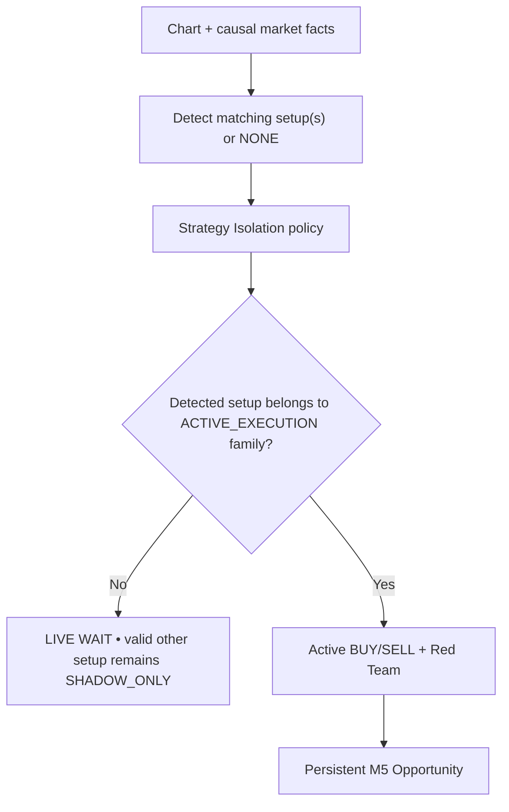

# GoldScalpTrader — Final Build / Replication Prompt

**Status:** FINAL DOCUMENTATION HANDOFF — IMPLEMENTATION MAY BEGIN ONLY FROM THIS CANONICAL MANUAL
**Version:** 2.0-institutional-scalp
**Authority:** Whole-project reconstruction brief for a capable developer/AI with no chat history. Topic-owner contracts override this summary.

## 1. Mission

Build **GoldScalpTrader**, a local Exness MT5 XAUUSD/XAUUSDm high-opportunity-recall, high-entry-precision Gold scalping system.

Product philosophy:

> **Opportunity-First, Evidence-Weighted, Precision-Timed, Cost-Aware, Execution-Disciplined and Continuously-Learning.**

The goal is to maximize qualified after-cost edge captured without weakening real financial/execution safety or forcing trades.

## 2. Preservation rule

GoldSwingTraderAI remains the feature/default reference baseline.

Change inherited behaviour only when the canonical Scalp manual classifies it as:

- direct Scalp-specific change;
- explicit operator-directed change;
- proven reference defect/current external fact correction.

Do not simplify/remove unrelated features for implementation convenience.

## 3. Setup detection comes before strategy eligibility

The market decides what setup exists.



Never take an active family and reinterpret every market episode to fit it.

Current live evaluation mode:

```text
exactly 1 ACTIVE_EXECUTION family
remaining 5 SHADOW_ONLY
```

All six analyze. Only the active family may originate a production trade, and only when its actual family setup is detected.

## 4. Preserved six families

```text
Trend Pullback Continuation
Breakout Expansion
Breakout Retest Continuation
Liquidity Sweep Reversal
Failed Breakout Reversal
Compression Expansion
```

A future Dynamic Strategy Router may be researched/promoted after clean per-family evidence, but it is not current production behaviour.

## 5. Runtime architecture

```text
one normalized MT5 read boundary
→ immutable MarketSnapshot
→ causal market intelligence
→ market-first Setup Detector across six families
→ one active + five shadow Strategy Isolation
→ active-family independent BUY/SELL + Red Team
→ persistent M5 Opportunity
→ subordinate M1 entry refinement
→ structural TradePlan
→ fresh Executable Quality
→ preserved monetary Risk
→ broker/session/account/exposure/persistence/controller hard authorities
→ central ExecutionPermissionGate
→ durable one-shot ExecutionIntent
→ fresh broker/order checks
→ sole MT5Writer
→ broker reconciliation
→ ManagedTrade / Trade Manager
→ verified close
→ exactly-once learning
→ discovery / autonomous invention / parameter tuning / advanced ML
→ automated evidence-stage progression
→ APPROVAL_REQUIRED before live production promotion
```

## 6. Timeframe authority

```text
H4   optional major context
H1   broad soft regime/context
M15  opportunity location/path/target context
M5   primary production setup/thesis + normal management structure
M1   subordinate entry refinement after valid M5 Opportunity
quote current executable Bid/Ask/spread/drift truth
```

M1 cannot create an independent production trade.

## 7. Evidence / confluence philosophy

EMA/RSI/Fib/FVG/OB/Trendline/POC/liquidity/session context may be extremely important to the strategy family that uses them.

But:

```text
important for one family
≠ universal requirement for every trade
```

Classify evidence by family as required/supportive/opposing/not relevant/unknown. Preserve causal event lineage so one market event is not counted repeatedly as independent certainty.

## 8. Opportunity and timing

A valid M5 setup creates a persistent Opportunity.

M1/current price can produce:

```text
READY
WAIT
MISSED
INVALID
```

Re-arm after terminal MISSED/INVALID requires genuinely fresh causal evidence. Next polling cycle alone is never a new setup.

Approved calibration dimensions include M1 patterns/freshness, M5 event age, chase distance and Approved Entry→Executable Price drift.

## 9. TradePlan

TradePlan owns:

- active family/Opportunity identity;
- Approved Entry Reference;
- family-correct structural invalidation/SL;
- Immediate Obstacle;
- Primary/Expansion/optional Runner objectives;
- immutable original R;
- gross structural R/room.

Risk does not edit structural SL to make minimum lot affordable.

Swing's fixed 1.20R hard floor is **not automatically imposed** as the Scalp hard floor. Scalp minimum gross R is evidence-calibrated.

## 10. Executable Quality

Use the approved hybrid model:

```text
absolute emergency spread ceiling
+ spread / structural SL
+ spread / remaining target room
+ spread versus recent healthy baseline
+ total expected cost / reward
+ slippage allowance
+ broker deviation policy
+ decision→send latency
+ executable-price drift/chase
```

Spread/SL and Spread/Target are explicitly approved dimensions.

Excess latency normally triggers fresh quote/geometry/Risk revalidation rather than automatic permanent rejection if the opportunity is still valid.

## 11. Preserved monetary Risk — DO NOT CHANGE

| Profile | DayStartEquity | Normal | Elevated | Hard ceiling | Daily lock |
|---|---:|---:|---:|---:|---:|
| SMALL | positive < $300 | 3.0–4.5% | >4.5–6.5% | 7% | 12% |
| MEDIUM | $300–$999.99 | 2.0–3.0% | >3.0–4.5% | 5% | 9% |
| NORMAL | >= $1,000 | 1.0–2.0% | >2.0–3.5% | 4% | 7% |

Preserve operator-requested aggressive capability, disabled by default:

```text
8%  maximum single-trade monetary SL-risk ceiling — NOT target
16% maximum aggregate open risk
16% daily loss ceiling
```

Preserve:

- manual daily-loss reset capability, disabled by default;
- one genuinely fresh same-episode re-entry;
- 3 consecutive closed bot losses → at least 30-minute cooldown + release conditions;
- one independently risk-bearing Gold position per scope;
- dynamic broker-aware volume/min-lot affordability;
- no martingale/grid/averaging down.

## 12. News and session

News/Fundamental is **soft context/research only**.

Do not implement:

- News hard entry block;
- News UNKNOWN hard kill switch;
- News cooldown;
- mandatory post-News warmup;
- News-driven forced close.

Provider/cache health stays visible; stale/unavailable data is never relabelled CLEAR.

Actual event-induced market deterioration is handled through real quote/spread/drift/dislocation/cost/slippage/latency/broker facts.

Hard broker/session safety is separate:

```text
Daily PRE_CLOSE   T-20 no entry / T-10 flatten
Weekend PRE_CLOSE T-60 no entry / T-30 flatten
Daily reopen      1 clean completed M5
Weekend reopen    2 clean completed M5 + gap assessment
```

These remain baselines pending current Exness proof.

## 13. Performance / concurrency

Logical analytical independence is mandatory. Physical concurrency is profiling-driven.

```text
shared calculations
→ vectorize/cache
→ deterministic serial baseline
→ profile
→ bounded parallelism only if critical path improves
```

One-worker and parallel outputs must be semantically identical.

Financial/broker authority remains strictly serial.

## 14. Execution safety

```text
upstream analytical/plan/quality/Risk stop
→ Gate NOT EVALUATED

hard authority reaches Gate and fails
→ Gate BLOCKED
```

When allowed:

```text
persist Intent
→ fresh quote/account/symbol/volume/stops/margin/order_check
→ persist SUBMITTING
→ one raw writer call
→ classify acknowledgement
→ reconcile
```

Ambiguous acknowledgement never gets blind retry.

Unknown exposure/account/history is never treated as zero.

## 15. Management

Actions:

```text
HOLD | PROTECT | TRAIL | RUNNER | EXIT
```

- time-efficiency failure can produce EXIT;
- Runner is exceptional and needs fresh continuation/objective;
- protection/trailing timing is calibrated;
- optional partial close where broker-valid/divisible;
- minimum-lot correctness never depends on partial close;
- stop never intentionally widens beyond approved risk;
- verified broker truth precedes durable local state changes.

## 16. Learning / discovery / ML

Backend capabilities are active by design:

```text
verified actual learning
+ shadow counterfactuals
+ missed/blocked episode analysis
→ StrategyMemory
→ discovery / strategy invention / parameter tuning / ML
→ replay / walk-forward / holdout / stress / shadow / candidate DEMO
→ APPROVAL_REQUIRED
```

The system may automatically tune/test candidate/shadow policies. It may not silently change the current production policy. Final live promotion always requires explicit operator approval.

## 17. Throughput objective

`~120 trades/day` is a research throughput benchmark, never a mandatory quota.

Measure jointly:

- Qualified Opportunity Recall;
- Opportunity Capture Rate;
- Net expectancy;
- false blocks;
- missed opportunity cost;
- Entry/Capture/Exit Efficiency;
- spread/slippage/latency burden;
- trades/hour/day;
- slot occupancy;
- drawdown/streaks;
- safety violations.

Never lower standards simply to hit the count.

## 18. Dashboard

Primary graphical UI follows the approved GoldSwingTraderAI institutional visual baseline adapted to Scalp:

- one screen;
- no scrollbars;
- central interactive chart;
- functional M1/M5/M15/H1/H4 buttons;
- functional Indicators/Drawings/Settings;
- Detected Setup separate from Active Test Family;
- shadow setups explicitly research-only;
- exact Current Signal/Reason;
- TradePlan and executable-quality blocker;
- MTF analysis;
- Account & Risk;
- Open Trade;
- Execution/Controller;
- Trading Activity;
- Learning/Discovery;
- System/Data;
- Recent Verified Closes.

Presentation is read-only and cannot grant authority.

## 19. Persistence / backup

Runtime:

```text
transactional local StateStore
→ rolling checkpoint
→ graceful-stop final verified checkpoint
→ optional portable runtime/learning recovery package
```

No runtime GitHub credentials, pull, commit or push.

Development:

```text
one coherent remote commit
→ operator git pull --ff-only
→ local clone + Git history
→ optional secret-clean ZIP
```

Same-scope active-active multi-machine execution and distributed DB/fencing are deferred. Sequential handoff only.

## 20. Code quality

Implement expert-level code:

- strong type hints;
- immutable typed DTOs where appropriate;
- enums/reason codes;
- no magic numbers;
- centralized versioned policy;
- comments/docstrings explaining why, chronology, safety, recovery and broker quirks;
- structured redacted logging;
- dependency injection around external boundaries;
- comprehensive deterministic/integration/connected proof;
- no unnecessary comment clutter.

## 21. Evidence boundary

Never confuse:

```text
DOCUMENTATION FROZEN
IMPLEMENTED
DETERMINISTIC PASS
REPLAY/CALIBRATION
CONNECTED READ PROOF
CONTROLLED DEMO PROOF
RECOVERY/HANDOFF PROOF
PRODUCTION PROMOTION APPROVAL
FUTURE REAL RELEASE
PROFITABILITY
```

## 22. Build order

Follow `01-foundation/BUILD_PHASES.md` and `07-engineering/MODULE_STRUCTURE.md` / `FILE_AND_TEST_CATALOG.md` exactly. If any implementation requirement conflicts with a topic-owner contract, stop and repair the documentation graph before coding further.
