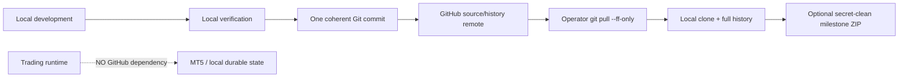
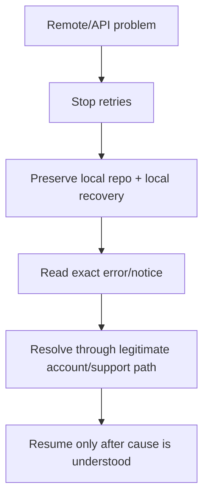

# GoldScalpTrader — GitHub Strict Use Policy

**Status:** FROZEN PROJECT POLICY — ACCOUNT SAFETY / ZERO-UNINTENDED-BILLING / LOW-CHURN REMOTE USE
**Version:** 1.0-scalp-reconstruction
**Authority:** GitHub account ownership, repository content, billing-risk boundaries, ChatGPT/GitHub operating discipline, remote incident response and source-publication rules.

## 1. Purpose

GitHub is a **development collaboration, source-history and remote recovery surface** for GoldScalpTrader. It is never a trading-runtime dependency and never grants broker authority.

This policy exists to prevent four classes of failure:

1. account/security misuse;
2. unnecessary paid or metered GitHub features;
3. accidental publication of credentials/runtime state/large artifacts;
4. noisy automation, retry storms or micro-commit behavior that increases operational risk.



## 2. Current repository fact versus policy recommendation

At the time this policy was reconstructed, `Hatoobachoo/GoldScalpTrader` is **public**. The operator explicitly chose **not to change repository visibility now**.

Therefore:

- this document does **not** falsely claim the repository is private;
- changing visibility requires explicit operator approval;
- while public, no proprietary secret, credential, private customer/business information, live runtime state or sensitive recovery artifact may be committed;
- future private visibility remains a security recommendation, not a silently executed change.

## 3. Account ownership and authorization

- Use only a legitimate GitHub account controlled by its rightful owner.
- Never share or borrow passwords, 2FA codes, recovery codes, session cookies, SSH private keys or personal access tokens.
- Do not create or rotate accounts/tokens to bypass a restriction, suspension or rate limit.
- Prefer official GitHub App/OAuth connector authorization with minimum repository scope.
- If a legitimate account is restricted or suspended, stop remote automation and use GitHub's normal support/appeal route.

## 4. GitHub is not runtime authority

The trading process must remain fully operable when GitHub is unavailable.

```text
GitHub outage
→ no effect on current MT5 truth
→ no effect on Strategy/TradePlan/Risk/Gate
→ no effect on local persistence/reconciliation
→ no effect on safe shutdown
```

The runtime must not:

- fetch or pull source automatically;
- commit or push on startup/shutdown;
- require GitHub credentials;
- query GitHub APIs to decide a trade;
- upload runtime databases/checkpoints automatically;
- treat remote source history as current broker truth.

## 5. Zero-unintended-billing target

Project target: **GitHub Free and no intentionally used paid/metered development infrastructure**.

Do not make these project dependencies unless the operator later explicitly approves a governed change:

- GitHub Actions hosted compute;
- Codespaces;
- Git LFS;
- paid Marketplace apps/trials;
- GitHub-hosted large datasets/models/backtests;
- paid cloud CI/CD.

Local verification is preferred for Ruff/formatting, compile, pytest, documentation validation, secret scanning and profiling.

No external provider can be guaranteed to remain free forever. The project therefore records the target and prohibited dependencies rather than claiming permanent zero billing.

## 6. Repository content contract

### Allowed

- source code;
- tests;
- canonical documentation;
- small scripts;
- placeholder configuration examples;
- lightweight deterministic fixtures.

### Never commit

- `.env` or live secrets;
- broker credentials/API keys/tokens/passwords/private keys/recovery codes;
- live SQLite runtime DB/WAL/SHM;
- runtime checkpoints containing sensitive operational data unless specifically sanitized and approved;
- `.venv`, caches, logs, temporary/build output;
- local backup ZIPs or recovery archives;
- large market-history exports, models or bulky generated data;
- account/session authentication artifacts.

`.env.example` contains placeholders only.

## 7. Commit and remote-use discipline

Normal development cadence:

```text
one coherent documentation/code packet
→ local/focused verification where available
→ inspect diff
→ one consolidated commit where practical
→ one remote update
→ operator performs one git pull --ff-only checkpoint
```

Avoid:

- microcommit storms;
- continuous polling;
- rapid push loops;
- unnecessary branches/PRs;
- repeated API retries;
- force-push of `main`;
- mutation probes merely to test connector behavior.

Large coherent bulks are preferred because they reduce inconsistency and remote/API churn.

## 8. Stop-on-error remote policy

On any of the following:

```text
401 / 403 / 429
rate-limit or abuse warning
account restriction/suspension
unexpected authorization/security notice
unexpected billing/metered-use signal
```

perform:



Never turn an access problem into a retry storm.

## 9. Secret protection

Before every source publication:

1. inspect changed/staged paths;
2. run the project financial-secret scanner when implemented;
3. verify `.env`, DB/state, keys, logs, caches and backup archives are absent;
4. reject real secret findings rather than bypassing them;
5. if a real secret was exposed, revoke/rotate it and remediate repository history when required.

A known synthetic test fixture may only be exempted through a narrow documented fixture-specific rule.

## 10. Branch/reference safety

- `main` is the simple default development line.
- No casual force push.
- Remote ref updates must be fast-forward unless a separately approved recovery incident requires otherwise.
- A connector/API write must use current base/ref identity and must not overwrite unseen concurrent work.
- Read operations may be batched; write operations are grouped into coherent packets.

## 11. Local source recovery

After an accepted major packet:

```powershell
git pull --ff-only
```

The local clone provides:

- latest accepted source;
- full reachable Git history;
- independent local working copy.

Optional milestone ZIP:

- created locally;
- secret-clean;
- excludes `.env`, credentials, runtime DB/state, caches and large generated artifacts;
- is not committed back into GitHub.

## 12. Relationship to runtime backup

Source-history recovery and trading-runtime-state recovery are distinct:

| Concern | Primary mechanism |
|---|---|
| source + development history | local Git + GitHub remote |
| optional offline source milestone | sanitized local/Drive ZIP/package |
| current broker truth | MT5 |
| runtime durable context | local StateStore/checkpoints |
| learning/research durable context | local verified state/checkpoint exports |
| cross-machine recovery | controlled restore + fresh broker reconciliation |

`BACKUP_SYNC_AND_RECOVERY_ARCHITECTURE.md` owns the complete recovery design.

## 13. Operator approval boundary

The following are never silently changed by an AI/developer:

- repository visibility;
- GitHub plan/paid products;
- branch model that changes recovery semantics;
- automated hosted workflows;
- authentication method requiring new secrets;
- runtime GitHub dependency;
- force-push/history rewrite.

They require explicit operator approval.

## 14. Pre-publication checklist

- [ ] change is one coherent logical packet;
- [ ] current `main` base/ref rechecked;
- [ ] no secrets/runtime DB/backups/large artifacts;
- [ ] documentation/code/tests are synchronized for the packet;
- [ ] no unrelated repository files modified;
- [ ] fast-forward update only;
- [ ] local pull instruction needed only after a meaningful milestone;
- [ ] remote error would stop retries rather than loop.

## 15. Final invariant

> **GitHub may store and collaborate on GoldScalpTrader source/history, but it never becomes trading authority, runtime availability dependency, secret storage, live-state storage, paid-cloud requirement or a reason to weaken local recovery discipline.**
