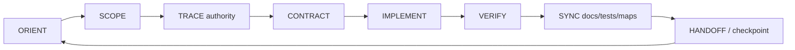
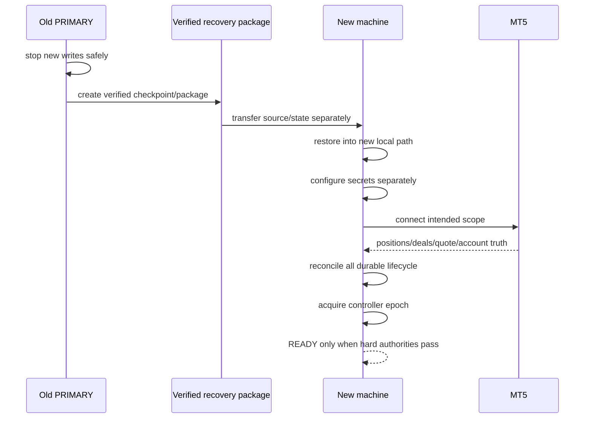

# GoldScalpTrader — Project Build and Recovery Guide

**Status:** FINAL BUILD/RECOVERY OPERATING MANUAL — DOCUMENTATION FREEZE BASELINE
**Version:** 2.0-institutional-scalp
**Authority:** AI/developer continuation, implementation order, context recovery, safe failure handling, source/runtime backup and machine handoff.

## 1. Mission

Build GoldScalpTrader from the canonical 66-document manual without relying on chat memory.

```text
DOCUMENTS
→ IMPLEMENTATION
→ TESTS
→ REPLAY/CALIBRATION
→ CONNECTED DEMO
→ RELEASE AUDIT
```

Production code must not outrun documentation.

## 2. Preservation rule

GoldSwingTraderAI is the feature/default baseline. Change inherited behaviour only when:

```text
direct Scalp reason
OR explicit operator decision
OR proven reference defect / current factual correction
```

Otherwise preserve it.

## 3. Canonical continuation loop



For every feature identify owner, typed facts, chronology, state machine, failure semantics, concurrency, persistence, broker/Risk effect, operator display, research effect and evidence boundary.

## 4. Context-loss recovery order

```text
current main HEAD
→ Documents/README.md
→ GLOSSARY.md
→ 01-foundation/SYSTEM_CONTRACT.md
→ 01-foundation/ARCHITECTURE.md
→ 08-governance/DOCUMENTATION_COMPARISON.md
→ 08-governance/PRESERVATION_LEDGER.md
→ relevant topic contract
→ DESIGN_DECISIONS / OPEN_QUESTIONS
→ 07-engineering/MODULE_STRUCTURE.md
→ FILE_AND_TEST_CATALOG.md
→ source/tests/evidence
```

Repository truth beats remembered instructions.

## 5. Final architecture orientation

```text
one normalized MT5 read boundary
→ immutable MarketSnapshot
→ causal intelligence
→ setup detection across six families
→ Strategy Isolation: 1 ACTIVE_EXECUTION + 5 SHADOW_ONLY
→ active family may proceed only if its own setup is actually detected
→ BUY/SELL + Red Team
→ persistent M5 Opportunity
→ subordinate M1 entry refinement
→ structural TradePlan
→ Executable Quality
→ preserved monetary Risk
→ hard market/account/exposure/controller authorities
→ Gate
→ durable one-shot Intent
→ sole MT5Writer
→ reconciliation
→ ManagedTrade
→ verified close
→ continuous learning/invention/ML
→ APPROVAL_REQUIRED before production promotion
```

## 6. No strategy forcing

The Setup Detector is market-first.

Example:

```text
chart forms Liquidity Sweep
active test family = Breakout Retest
→ Breakout Retest is NOT fabricated
→ live WAIT
→ Liquidity Sweep recorded as shadow evidence
```

The active family controls live eligibility, not market classification.

## 7. Timeframes

```text
H4 optional major context
H1 broad regime
M15 location/path/target context
M5 setup/thesis + normal management
M1 subordinate entry refinement after valid M5 Opportunity
quote current executable truth
```

## 8. Risk / execution / News

Preserve exact SMALL/MEDIUM/NORMAL Risk bands and disabled-by-default aggressive 8%/16% capability.

Preserve one fresh same-episode re-entry and 3-loss/30m cooldown baseline.

News/Fundamental remains soft context only. No News hard block/cooldown/warmup. Actual bad execution conditions are handled by quote/spread/drift/cost/data/broker authorities.

## 9. Test failure loop

```text
reproduce
→ identify invariant/owner
→ fix root cause
→ add regression
→ run focused tests
→ run integration/full local verification
→ update affected docs/maps
```

Never replace UNKNOWN with optimistic zero/PASS to make tests green.

## 10. Broker-write crash rule

If Intent is `SUBMITTING` or acknowledgement is ambiguous:

```text
DO NOT RESEND
→ restore Intent
→ query current broker truth
→ reconcile positions/orders/deals
→ only after resolution may a new governed Intent exist
```

## 11. Corrupt/missing runtime state

Do not delete state and start clean.

```text
block affected write authority
→ preserve diagnostics
→ restore last verified checkpoint to NEW path if required
→ connect intended MT5 scope
→ reconcile Risk / Intent / ManagedTrade / learning
→ acquire controller
→ remain RECONCILING until required truth is known
```

## 12. Sequential machine recovery

Same-account/symbol active-active is deferred.



## 13. Runtime backup

```text
transactional StateStore
→ rolling checkpoint
→ graceful-stop final checkpoint
→ optional portable runtime/learning package
```

No Git command runs during bot shutdown.

## 14. Development/source backup

After a meaningful coherent remote milestone:

```powershell
cd "D:\Trading Bot\GoldScalpTrader"
git pull --ff-only
```

Optional secret-clean ZIP may be created separately. Avoid micro-pull/micro-commit churn.

## 15. Implementation order

Follow `01-foundation/BUILD_PHASES.md`.

High-level order:

```text
config/domain
→ MT5 read boundary / MarketSnapshot
→ intelligence
→ six families + setup detection/isolation
→ Opportunity/M1 timing
→ TradePlan/Executable Quality
→ Risk/session/exposure
→ persistence/recovery
→ integrated DRY_RUN
→ DEMO Intent/writer/reconcile
→ Trade Manager
→ dashboards
→ learning/research/invention/ML
→ backup/handoff
→ connected DEMO certification
→ future REAL gate
```

## 16. Dashboard implementation rule

The approved primary graphical dashboard is one-screen, no-scroll and Swing-style institutional. Chart controls are functional, not decorative.

Dashboard must separately show:

```text
Detected Setup
Active Test Family
Shadow Setup(s)
Current Signal
Exact Blocker
Gate State
TradePlan
Risk
Execution
Learning
System/Data
```

## 17. Evidence order

```text
documented design
≠ implementation
≠ deterministic test pass
≠ replay evidence
≠ connected read proof
≠ controlled DEMO execution proof
≠ recovery proof
≠ future REAL release proof
≠ profitability guarantee
```

## 18. Handoff requirement

A coherent implementation packet leaves:

- current main SHA;
- exact files changed;
- tests actually run/results;
- pending calibration/external proof;
- any unresolved blocker;
- one next dependency;
- no hidden background work.
