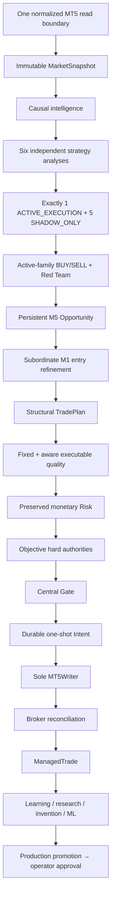

# GoldScalpTrader — Canonical Documentation Manual

**Status:** 66-DOCUMENT INSTITUTIONAL RECONSTRUCTION IN PROGRESS — IMPLEMENTATION NOT STARTED
**Version:** 2.0-reference-depth-rebuild
**Authority:** Documentation entry point, current reconstruction status, reading order, design-before-code boundary and project-wide approved architecture summary.

## 1. What this manual is

`Documents/` is the durable design/implementation/proof baseline for GoldScalpTrader.

A future developer or AI must be able to rebuild the project from this manual without relying on chat history.

The manual is being reconstructed against the latest verified GoldSwingTraderAI `Published_B/Documents` reference tree because the prior Scalp manual had correct high-level concepts but materially compressed many institutional details and omitted two top-level reference documents.

## 2. Verified reference-tree finding

Latest verified reference inventory:

```text
Top-level Markdown documents     9
00-foundation                    5
10-market-intelligence           7
20-trading-decisions             7
30-risk-execution                6
40-research-learning             7
50-operator                      3
60-engineering                  14
90-governance                    8
TOTAL                           66
```

Prior GoldScalpTrader manual contained 64 files and was missing:

```text
GITHUB_STRICT_USE_POLICY.md
BACKUP_SYNC_AND_RECOVERY_ARCHITECTURE.md
```

Both are now part of the reconstruction target.

## 3. Current project stage


Current status:

```text
reference tree parity audit                  COMPLETE
missing-document identification              COMPLETE
operator architecture decisions              APPROVED
Foundation/policy reconstruction             IN PROGRESS
Market/Decision/Risk/Research/Operator docs  PENDING RECONSTRUCTION
Engineering/audit depth restoration          PENDING RECONSTRUCTION
folder numbering migration                   PENDING ATOMIC RENAME
full 66-doc cross-link audit                 PENDING
100+ post-rebuild challenge                  PENDING
operator final documentation approval        PENDING
implementation                               NOT STARTED
```

The prior “64-file manual complete” claim is superseded.

## 4. Approved final folder numbering

Final target:

```text
Documents/
├── README.md
├── GLOSSARY.md
├── GITHUB_STRICT_USE_POLICY.md
├── BACKUP_SYNC_AND_RECOVERY_ARCHITECTURE.md
├── CODER_GUIDE.md
├── PROJECT_BUILD_AND_RECOVERY_GUIDE.md
├── FINAL_BUILD_PROMPT.md
├── USER_MANUAL.md
├── SETUP_AND_RUN_GUIDE.md
├── 01-foundation/
├── 02-market-intelligence/
├── 03-trading-decisions/
├── 04-risk-execution/
├── 05-research-learning/
├── 06-operator/
├── 07-engineering/
└── 08-governance/
```

The old `00/10/20/...` paths remain temporarily only while reconstruction is staged. Final freeze requires one atomic rename/cross-link migration with no broken links.

## 5. Current reading order during reconstruction

Until final rename:

1. `README.md`;
2. `GITHUB_STRICT_USE_POLICY.md`;
3. `BACKUP_SYNC_AND_RECOVERY_ARCHITECTURE.md`;
4. `GLOSSARY.md`;
5. `00-foundation/PROJECT_VISION.md`;
6. `00-foundation/SYSTEM_CONTRACT.md`;
7. `00-foundation/ARCHITECTURE.md`;
8. `00-foundation/TRADING_FLOOR_ARCHITECTURE.md`;
9. `00-foundation/BUILD_PHASES.md`;
10. topic-owner contracts;
11. `90-governance/DOCUMENTATION_STANDARD.md`;
12. engineering source/test/audit maps;
13. operator/manual/handoff guides.

Conflict order:

```text
SYSTEM_CONTRACT
→ owning topic contract
→ active DESIGN_DECISIONS
→ OPEN_QUESTIONS
→ Architecture / Trading Floor
→ engineering/operator summaries
```

## 6. Approved product philosophy

GoldScalpTrader is:

> **Opportunity-First, Evidence-Weighted, Precision-Timed, Cost-Aware, Execution-Disciplined and Continuously-Learning.**

The system should maximize qualified opportunities and entry efficiency without weakening objective broker/account safety.

## 7. Approved trading architecture



## 8. Strategy Isolation Mode

The operator approved live strategy efficiency testing one family at a time.

```text
Six families analyze every eligible episode
Exactly one family may originate live trades
Remaining five are shadow/research only
```

This prevents blended voting from hiding which family actually has edge.

The six preserved families remain:

1. Trend Pullback Continuation
2. Breakout Expansion
3. Breakout Retest Continuation
4. Liquidity Sweep Reversal
5. Failed Breakout Reversal
6. Compression Expansion

## 9. Timeframe roles

```text
H4   optional major context
H1   broad regime/directional context
M15  opportunity location/path/target context
M5   primary setup/thesis + management structure
M1   subordinate entry refinement after valid M5 Opportunity
quote/tick current executable Bid/Ask/spread/drift truth
```

M1 cannot create an independent production trade.

## 10. News/Fundamental policy

Approved change:

> **News/Fundamentals are soft context, dashboard and research attribution only.**

News/event/API status does not directly:

- hard-block a trade;
- trigger a News cooldown;
- require a post-News warmup;
- force-close an otherwise valid trade.

Actual event-induced market problems are handled by measurable spread, cost, drift, quote health, dislocation, slippage/latency and broker facts.

## 11. Spread / cost policy

Approved hybrid model:

```text
absolute emergency spread ceiling
+
spread / structural SL
+
spread / target room
+
spread versus recent healthy baseline
+
total expected cost / reward
```

Spread/SL and spread/target dimensions are approved. Exact thresholds remain calibration evidence.

## 12. Preserved monetary Risk

Do **not** change the existing profile percentages/bands.

| Profile | DayStartEquity | Normal | Elevated | Hard ceiling | Daily lock |
|---|---:|---:|---:|---:|---:|
| SMALL | positive < $300 | 3.0–4.5% | >4.5–6.5% | 7% | 12% |
| MEDIUM | $300–$999.99 | 2.0–3.0% | >3.0–4.5% | 5% | 9% |
| NORMAL | >= $1,000 | 1.0–2.0% | >2.0–3.5% | 4% | 7% |

Preserved aggressive small-account option, disabled by default:

```text
8% maximum single-trade monetary SL-risk ceiling — NOT target
16% maximum aggregate open risk
16% daily loss ceiling
```

Preserved baseline, later research/calibration allowed:

- one genuinely fresh same-episode re-entry;
- three consecutive closed bot losses → at least 30-minute cooldown.

## 13. 120 trades/day benchmark

Approved as a **research throughput benchmark**, never a forced quota.

The bot must diagnose whether low throughput is caused by:

- lack of genuine opportunities;
- active strategy quality;
- M1 timing;
- chase/drift;
- spread/cost burden;
- Risk/min-lot/margin;
- cooldown;
- position occupancy;
- actual broker closure/permissions;
- system latency/fault.

The objective is maximum qualified after-cost edge captured, not maximum raw trade count.

## 14. Continuous learning / invention / ML

The following are active backend capabilities once their evidence inputs exist:

- autonomous strategy invention;
- candidate parameter tuning;
- advanced ML research;
- automated candidate evidence-stage progression.

They may test/iterate in research, replay, holdout, shadow and controlled DEMO lanes.

**Production/live promotion requires explicit operator approval.**

## 15. Performance architecture

Logical analytical independence is mandatory. Physical analytical concurrency is profiling-driven.

```text
share calculations
→ vectorize/cache
→ profile
→ bounded-parallelize only measured independent bottlenecks
```

Financial/broker authority remains serial:

```text
TradePlan
→ Executable Quality
→ Risk
→ hard authorities
→ Gate
→ Intent
→ broker checks
→ sole writer
→ reconciliation
```

## 16. Documentation quality rule

Every relevant contract must be deeply explained with the appropriate mix of:

- Mermaid topology/flow diagrams;
- state diagrams;
- sequence diagrams;
- tables/matrices;
- formulas;
- examples;
- explicit owner/non-authority;
- failure/recovery cases;
- source/test/evidence mapping.

Performance charts use real replay/DEMO data only; fake empirical charts are prohibited.

Code, when implementation begins, must be clean, typed, optimized, reason-rich and heavily documented where reasoning/safety is non-obvious.

## 17. GitHub / recovery policy

GitHub stores source/history only and is never trading-runtime authority. Current repository visibility remains unchanged because the operator explicitly said **not now** regarding privacy.

Runtime uses local durable state/checkpoints. Development uses coherent commits and operator `git pull --ff-only` checkpoints. Optional independent clean/off-site recovery packages remain separate from live runtime state.

## 18. Evidence boundary

Keep separate:

```text
APPROVED DOCUMENTED DESIGN
DOCUMENTATION RECONSTRUCTION COMPLETE
IMPLEMENTATION COMPLETE
DETERMINISTIC TEST PASS
REPLAY / CALIBRATION EVIDENCE
CONNECTED READ EVIDENCE
CONTROLLED DEMO EVIDENCE
RECOVERY/HANDOFF EVIDENCE
PRODUCTION PROMOTION APPROVAL
FUTURE REAL RELEASE APPROVAL
PROFITABILITY CLAIM
```

No earlier evidence class automatically proves the later one.

## 19. Next step

Complete the 66-document institutional reconstruction first. Then perform:

1. atomic folder-numbering/cross-link migration;
2. full section-level reference→Scalp coverage matrix;
3. new 100+ challenge audit;
4. final operator review;
5. documentation freeze;
6. only then implementation.
