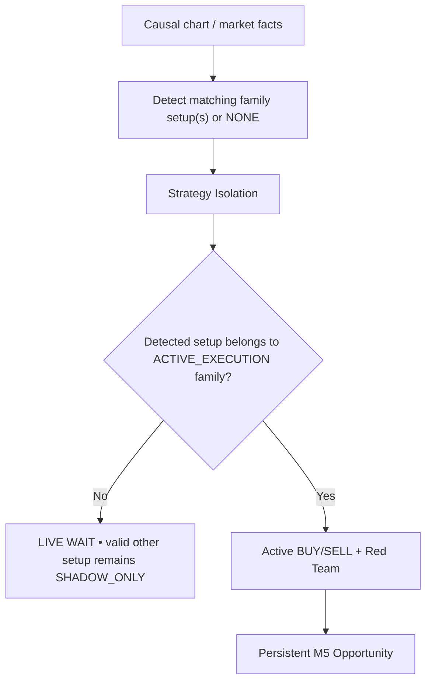

# GoldScalpTrader — Canonical Documentation Manual

**Status:** DOCUMENTATION FROZEN — IMPLEMENTATION READY / CODE EVIDENCE PENDING
**Version:** 2.1-final-66-document-baseline
**Authority:** Documentation entry point, final architecture summary, reading order, evidence boundary and design-before-code contract.

## 1. Final manual status

GoldScalpTrader now uses a **66-document canonical manual** reconstructed against the latest verified GoldSwingTraderAI `Published_B/Documents` reference topology and adapted only for approved Scalp/operator differences.

```text
Top-level manuals/policies       9
01-foundation                    5
02-market-intelligence           7
03-trading-decisions             7
04-risk-execution                6
05-research-learning             7
06-operator                      3
07-engineering                  14
08-governance                    8
TOTAL                           66
```

The two reference documents previously missing from Scalp are restored/adapted:

```text
GITHUB_STRICT_USE_POLICY.md
BACKUP_SYNC_AND_RECOVERY_ARCHITECTURE.md
```

## 2. Canonical folder tree

```text
Documents/
├── README.md
├── GLOSSARY.md
├── GITHUB_STRICT_USE_POLICY.md
├── BACKUP_SYNC_AND_RECOVERY_ARCHITECTURE.md
├── CODER_GUIDE.md
├── PROJECT_BUILD_AND_RECOVERY_GUIDE.md
├── FINAL_BUILD_PROMPT.md
├── USER_MANUAL.md
├── SETUP_AND_RUN_GUIDE.md
├── 01-foundation/
├── 02-market-intelligence/
├── 03-trading-decisions/
├── 04-risk-execution/
├── 05-research-learning/
├── 06-operator/
├── 07-engineering/
└── 08-governance/
```

Old `00/10/20/30/40/50/60/90` category names are retired.

## 3. Reading order

Recommended:

1. `README.md`;
2. `GLOSSARY.md`;
3. `GITHUB_STRICT_USE_POLICY.md`;
4. `BACKUP_SYNC_AND_RECOVERY_ARCHITECTURE.md`;
5. `01-foundation/PROJECT_VISION.md`;
6. `01-foundation/SYSTEM_CONTRACT.md`;
7. `01-foundation/ARCHITECTURE.md`;
8. `01-foundation/TRADING_FLOOR_ARCHITECTURE.md`;
9. `01-foundation/BUILD_PHASES.md`;
10. relevant topic-owner contract;
11. `08-governance/DESIGN_DECISIONS.md` and `OPEN_QUESTIONS.md`;
12. `08-governance/DOCUMENTATION_COMPARISON.md` for exact Swing→Scalp changes;
13. `07-engineering/MODULE_STRUCTURE.md` and `FILE_AND_TEST_CATALOG.md` before coding.

Conflict order:

```text
SYSTEM_CONTRACT
→ owning topic contract
→ final DESIGN_DECISIONS
→ OPEN_QUESTIONS classification
→ Architecture / Trading Floor
→ engineering/operator summaries
```

## 4. Final product philosophy

> **Opportunity-First, Evidence-Weighted, Precision-Timed, Cost-Aware, Execution-Disciplined and Continuously-Learning.**

Formal objective:

> Maximize qualified after-cost edge captured while preserving documented monetary and broker/execution safety.

Do not optimize win rate, trade count or “perfect confirmation” in isolation.

## 5. Market-first setup rule

The most important final strategy rule:

> **The chart/market determines what setup actually exists. The active strategy is never forced into every trade.**



Current evaluation policy:

```text
1 ACTIVE_EXECUTION family
5 SHADOW_ONLY families
```

All six analyze; only the active family can originate a live production Opportunity, and only if its own setup is genuinely present.

## 6. Six preserved strategy families

```text
Trend Pullback Continuation
Breakout Expansion
Breakout Retest Continuation
Liquidity Sweep Reversal
Failed Breakout Reversal
Compression Expansion
```

No family was removed.

A future Dynamic Strategy Router may be researched after sufficient clean family-isolation evidence; it is not current production behavior.

## 7. Timeframe authority

```text
H4   optional major context
H1   broad soft regime/context
M15  opportunity location/path/target context
M5   primary setup/thesis + normal management structure
M1   subordinate entry refinement after valid M5 Opportunity
quote current executable Bid/Ask/spread/drift truth
```

M1 cannot independently create a production trade.

## 8. Evidence without filter soup

Structure, EMA/RSI/ATR, liquidity/SMC, FVG, OB, trendline, Fibonacci, POC, session and other context may be important.

But:

```text
important to one family
≠
universal requirement for every family/trade
```

Family definitions own required/supportive/opposing evidence. Causal lineage prevents one event from being counted repeatedly as independent confidence.

## 9. Entry / TradePlan / executable quality

```text
qualified active-family M5 setup
→ persistent Opportunity
→ M1 READY/WAIT/MISSED/INVALID
→ structural TradePlan
→ fresh Executable Quality
```

TradePlan owns structural invalidation/SL/objectives/gross R.

Executable Quality owns:

```text
absolute emergency spread ceiling
spread / SL
spread / target
recent healthy spread comparison
cost / reward
slippage allowance
broker deviation context
decision→send latency
drift / chase
```

Swing's fixed 1.20R floor is not automatically imposed as the hard Scalp floor.

## 10. Preserved monetary Risk — do not change silently

| Profile | DayStartEquity | Normal | Elevated | Hard ceiling | Daily lock |
|---|---:|---:|---:|---:|---:|
| SMALL | positive < $300 | 3.0–4.5% | >4.5–6.5% | 7% | 12% |
| MEDIUM | $300–$999.99 | 2.0–3.0% | >3.0–4.5% | 5% | 9% |
| NORMAL | >= $1,000 | 1.0–2.0% | >2.0–3.5% | 4% | 7% |

Preserved disabled-by-default aggressive capability:

```text
8%  maximum single-trade monetary SL-risk ceiling — NOT target
16% maximum aggregate open risk
16% daily loss ceiling
```

Also preserved:

- manual daily-loss reset capability, disabled by default;
- one genuinely fresh same-episode re-entry;
- three consecutive closed bot losses → at least 30-minute cooldown + release conditions;
- one independently risk-bearing Gold position initially;
- dynamic broker-aware sizing/min-lot actual-risk evaluation;
- no stop distortion to fit minimum volume;
- no martingale/grid/averaging down.

## 11. News / broker session

Final News rule:

```text
News/Fundamental = soft context / dashboard / research
```

No News-only hard entry block, News cooldown, mandatory post-News warmup or forced close.

Actual event-induced spread/drift/dislocation/slippage/data problems are governed by real market/execution owners.

Broker session remains separate hard authority. Preserved baselines pending current Exness proof:

```text
Daily:   T-20 no entry / T-10 flatten
Weekend: T-60 no entry / T-30 flatten
Daily reopen:   1 clean completed M5
Weekend reopen: 2 clean completed M5 + gap assessment
```

## 12. Execution safety

```text
TradePlan
→ Executable Quality
→ monetary Risk
→ objective hard authorities
→ Gate
→ durable one-shot Intent
→ fresh broker checks/order_check
→ sole MT5Writer
→ acknowledgement classification
→ broker reconciliation
```

Upstream stop means `Gate NOT_EVALUATED`.

Ambiguous acknowledgement means `ACCEPTED_UNKNOWN → reconcile`, never blind retry.

## 13. Management

```text
HOLD | PROTECT | TRAIL | RUNNER | EXIT
```

Time-efficiency may produce EXIT. Runner is exceptional and requires fresh continuation/objective. Optional partial management remains where broker-valid/divisible; minimum-lot correctness never depends on it.

## 14. Continuous learning / AI / invention

Backend improvement remains active:

```text
actual verified learning
+ shadow counterfactuals
+ missed/blocked episodes
→ StrategyMemory
→ discovery / autonomous invention / parameter tuning / advanced ML
→ replay / validation / holdout / stress / shadow / candidate DEMO
→ APPROVAL_REQUIRED
```

Production/live policy cannot silently self-change. Final promotion requires explicit operator approval.

## 15. Throughput benchmark

Approximately 120 trades/day is a research throughput benchmark, not a quota.

The system measures where throughput is lost and whether those lost opportunities had genuine after-cost value.

## 16. Approved graphical dashboard

The approved primary graphical UI follows the GoldSwingTraderAI institutional one-screen design adapted to Scalp.

Required:

- no scrollbars;
- central interactive chart;
- functional M1/M5/M15/H1/H4 controls;
- functional Indicators/Drawings/Settings;
- Detected Setup;
- Active Test Family;
- shadow setup/family status;
- signal + exact reason;
- TradePlan/current blocker;
- MTF analysis;
- Account/Risk;
- Open Trade;
- Execution/Controller;
- Trading Activity;
- Learning/Discovery;
- System/Data;
- Recent Verified Closes.

Dashboard remains read-only regarding trading authority.

## 17. Runtime / backup / GitHub

Runtime:

```text
local transactional StateStore
→ rolling checkpoint
→ graceful-stop verified checkpoint
→ optional portable runtime/learning package
```

No trading-runtime Git operations or GitHub credentials.

Development:

```text
coherent remote commit
→ operator git pull --ff-only
→ local clone + Git history
→ optional secret-clean ZIP
```

Same-scope active-active/distributed writer and distributed DB/fencing are deferred; sequential handoff is current architecture.

## 18. Documentation challenge result

`07-engineering/AUDIT_1_FRESH_DESIGN_REVIEW.md` contains 100 primary challenges plus additional meta-challenges.

Final result: no unresolved core architecture question remains. Pending work is explicitly classified as calibration, external proof, deferred architecture or future approval.

## 19. Exact Swing → Scalp differences

Read:

`08-governance/DOCUMENTATION_COMPARISON.md`

It separates:

1. genuine Scalp-specific changes;
2. explicit operator-directed/project-operating changes;
3. Swing features/defaults intentionally preserved.

## 20. Evidence boundary

Documentation is frozen, but these are still later evidence stages:

```text
implementation
unit/integration tests
replay/calibration
current Exness connected proof
controlled DEMO lifecycle
recovery/handoff certification
future REAL release
profitability
```

## 21. Next project phase

After the final 66-document tree/path commit is verified, **implementation may begin with Phase 1 from `01-foundation/BUILD_PHASES.md`**. No later code change may contradict these documents without first reopening and synchronizing the affected documentation graph.
