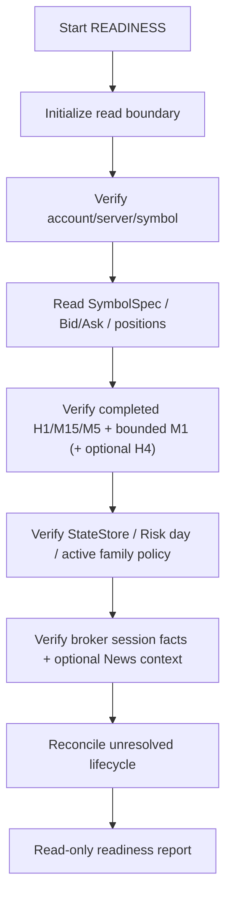

# GoldScalpTrader — Setup and Run Guide

**Status:** FINAL OPERATOR TARGET — DOCUMENTATION FREEZE BASELINE / IMPLEMENTATION PENDING
**Version:** 2.0-institutional-scalp
**Authority:** Intended installation, configuration, runtime stages, local paths, dashboard launch shape, backup, restore and operator verification.

## 1. Current truth

GoldScalpTrader documentation is the target specification. The repository still contains provisional code and does not yet prove the final runtime.

Commands in this guide are intended implementation targets until the exact packaging/runtime is built and verified.

## 2. Intended Windows environment

Target operating environment:

- Windows desktop/laptop;
- MetaTrader 5 terminal connected to the intended Exness account/server;
- local repository path, normally `D:\Trading Bot\GoldScalpTrader`;
- Python version verified against the current MetaTrader5 package during implementation;
- local writable state/backup directories;
- no requirement for GitHub credentials inside the trading runtime.

Secrets remain local and uncommitted.

## 3. Runtime capability stages

```text
READINESS  read-only identity/data/recovery checks
DRY_RUN    full analytical/Risk/permission path with zero irreversible writes
DEMO       one governed PRIMARY writer after its deterministic/evidence gate
REAL       preserved future capability after separate DEMO/release proof + approval
```

Same-account/symbol active-active writers are not supported in the current architecture.

## 4. Intended install shape

After packaging is implemented, the expected local workflow is approximately:

```powershell
cd "D:\Trading Bot\GoldScalpTrader"
python -m venv .venv
.\.venv\Scripts\Activate.ps1
python -m pip install --upgrade pip
python -m pip install -e ".[dev,mt5]"
Copy-Item .env.example .env
```

Do not treat this as current proof until the packaging phase creates and tests the exact project metadata.

## 5. Configuration families

Expected settings include:

- runtime stage/mode;
- intended account/server identity;
- preferred Gold symbol and approved aliases;
- magic/comment identity;
- local state/checkpoint paths;
- deterministic analytical scheduler/worker policy;
- active strategy family + policy version;
- preserved SMALL/MEDIUM/NORMAL Risk policy;
- aggressive-small-account enable flag, default false;
- manual daily-loss reset enable flag, default false;
- session schedule policy/version;
- optional News/context provider/cache settings;
- logging/diagnostics settings;
- dashboard host/port/local-only settings where graphical UI is enabled.

Hard policy is not an ad-hoc dashboard toggle.

## 6. Setup Detector / Strategy Isolation configuration

The runtime must preserve two distinct concepts:

```text
Detected Setup
vs
Active Test Family
```

Example:

```text
ACTIVE_EXECUTION=BREAKOUT_RETEST
Detected Setup=LIQUIDITY_SWEEP_REVERSAL
→ LIVE WAIT
→ Liquidity Sweep remains SHADOW_ONLY evidence
```

Changing the active production family is a governed/versioned policy change. The setup detector itself continues to inspect all six family definitions.

## 7. Timeframes

Expected production data:

```text
H1   broad regime/context
M15  location/path/target context
M5   primary setup/thesis + management structure
M1   subordinate entry refinement after M5 Opportunity
H4   optional major context
quote current executable condition
```

M1 is not a standalone production strategy.

## 8. Preserved monetary-policy reference

The implementation must reproduce the canonical documented profiles exactly:

| Profile | DayStartEquity | Normal | Elevated | Hard ceiling | Daily lock |
|---|---:|---:|---:|---:|---:|
| SMALL | positive < $300 | 3.0–4.5% | >4.5–6.5% | 7% | 12% |
| MEDIUM | $300–$999.99 | 2.0–3.0% | >3.0–4.5% | 5% | 9% |
| NORMAL | >= $1,000 | 1.0–2.0% | >2.0–3.5% | 4% | 7% |

The preserved optional aggressive-small-account capability remains disabled by default. Its documented reference ceilings are 8% maximum single-trade monetary SL risk (not a target), 16% aggregate open risk and 16% daily loss.

The current documentation also preserves one genuinely fresh same-episode re-entry and the 3-loss / at-least-30-minute cooldown baseline.

## 9. News / session configuration

News/context provider settings affect analytical/dashboard context, not a News-only trading kill switch.

A provider/cache may expose:

```text
VERIFIED / DEGRADED / STALE / UNAVAILABLE / UNKNOWN
```

The preserved context TTL baseline is 1800 seconds. Cache timestamps are never laundered to appear fresh.

Hard broker/session safety is separate. Baseline policy pending connected Exness verification:

```text
Daily no-entry / flatten    T-20 / T-10
Weekend no-entry / flatten  T-60 / T-30
Daily reopen                1 clean completed M5
Weekend reopen              2 clean completed M5 + gap assessment
```

## 10. READINESS target

Expected READINESS flow:



No irreversible broker write.

## 11. DRY_RUN target

```text
MarketSnapshot
→ intelligence
→ setup detection across six families
→ active/shadow Strategy Isolation
→ active BUY/SELL + Red Team
→ M5 Opportunity
→ M1 refinement
→ TradePlan
→ Executable Quality
→ monetary Risk
→ hard permission/Gate diagnostics
→ STOP before raw writer
```

DRY_RUN should still record shadow/missed/blocker/throughput research evidence where the owning contracts permit.

## 12. Controlled DEMO target

After deterministic implementation proof:

```text
startup/recovery
→ acquire controller
→ READY
→ governed cycles
→ one-shot Intent
→ fresh broker checks / order_check
→ sole MT5Writer
→ reconciliation
→ ManagedTrade
```

Ambiguous acknowledgement is reconciled, never blindly retried.

## 13. Approved graphical dashboard target

The graphical dashboard must be local/read-only with respect to trading authority and follow the approved Swing-style institutional one-screen layout.

Required UI properties:

- no scrollbars;
- central chart;
- functional timeframe buttons `M1`, `M5`, `M15`, `H1`, `H4`;
- functional `Indicators`, `Drawings`, `Settings` controls;
- chart zoom/pan/crosshair/tooling appropriate to implementation;
- Detected Setup panel;
- Active Test Family + Shadow families;
- signal/reason;
- TradePlan/current quality/blocker;
- Risk/account;
- execution/controller;
- activity;
- learning/discovery;
- system/data;
- recent verified closes.

No UI button may bypass normal trading authority.

## 14. Graceful shutdown target

```text
stop new entry scheduling
→ preserve/finish safe lifecycle transitions
→ persist current state
→ create fresh verified local checkpoint
→ secret/integrity checks as applicable
→ release controller
→ release MT5 resources
→ report shutdown/backup result
```

No Git fetch/add/commit/push occurs during runtime shutdown.

## 15. Runtime restore / laptop handoff

```text
old same-scope PRIMARY stopped
→ verified state package/checkpoint
→ restore into NEW local state path
→ configure secrets separately
→ connect intended MT5 account/server/symbol
→ read positions/deals/quote/account
→ reconcile Risk/Intent/ManagedTrade/learning
→ acquire new controller epoch
→ READY only after hard authorities pass
```

Distributed DB/fencing and same-scope active-active are deferred.

## 16. Development/source synchronization

After a meaningful remote documentation/code milestone:

```powershell
cd "D:\Trading Bot\GoldScalpTrader"
git pull --ff-only
```

Avoid repeated cloning or unnecessary micro-pulls. The local clone holds source plus reachable Git history.

Optional secret-clean source ZIPs are separate artifacts and are not committed back into the repository.

## 17. Intended local verification

After implementation tooling exists:

```powershell
python -m pytest -q
python -m ruff check src tests scripts
python -m compileall -q src tests scripts
git diff --check
python scripts/scan_financial_secrets.py .
python scripts/verify_documents_manual.py .
```

Additional tests/commands are defined by `07-engineering/TESTING_AND_VERIFICATION.md` and the file/test catalog.

## 18. Failure interpretation

Examples:

```text
positions=[]       → verified zero current positions
positions=None     → unavailable, not zero
News unavailable   → context degraded, not a News-only hard block
session UNKNOWN    → hard broker/session permission unresolved
Intent SUBMITTING  → reconcile, do not resend
StateStore corrupt → fail affected authority / restore verified state to new path
shadow setup valid → research evidence, not live trade authority
```

## 19. Proof boundary

A clean local launch does not prove trading edge. Keep separate:

```text
install proof
unit/integration proof
replay/calibration
connected READINESS proof
controlled DEMO execution proof
recovery/handoff proof
future REAL release approval
profitability
```
