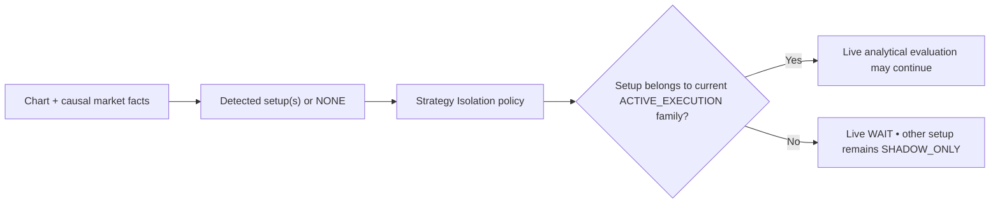

# GoldScalpTrader — User Manual

**Status:** FINAL OPERATOR MANUAL — DOCUMENTATION FREEZE BASELINE / IMPLEMENTATION PENDING
**Version:** 2.0-institutional-scalp
**Authority:** Human-facing description of the intended GoldScalpTrader system. Technical topic contracts remain authoritative.

## 1. Product overview

GoldScalpTrader is the documented target design for a local Exness MT5 XAUUSD/XAUUSDm scalping research/trading system. The manual distinguishes analytical setup detection, timing, structural planning, monetary policy, broker execution, management, learning and operator presentation.

No documentation statement is a profitability guarantee or proof that the current provisional code already implements the behaviour.

## 2. Market-first setup detection

The system is designed to identify what setup the chart/market actually forms before deciding whether that setup is live-eligible.



The active test family is never forced onto an unrelated chart pattern.

Example display:

```text
Detected Setup: Liquidity Sweep Reversal
Active Test Family: Breakout Retest
Live Action: WAIT
Shadow: Liquidity Sweep Reversal • valid research observation
```

## 3. Six preserved strategy families

1. Trend Pullback Continuation
2. Breakout Expansion
3. Breakout Retest Continuation
4. Liquidity Sweep Reversal
5. Failed Breakout Reversal
6. Compression Expansion

During Strategy Isolation Mode, exactly one family is `ACTIVE_EXECUTION`; the remaining five are `SHADOW_ONLY`. All may analyze, but only the active family may originate a production Opportunity and only when its own setup is genuinely detected.

## 4. Timeframes

```text
H4   optional major context
H1   broad regime/context
M15  opportunity location/path/target context
M5   primary setup/thesis + normal management structure
M1   subordinate entry refinement after valid M5 Opportunity
quote current Bid/Ask/spread/drift truth
```

M1 cannot independently create a production trade.

## 5. Evidence and confluence

The analytical system can use structure/BOS/MSS, support/resistance, liquidity/sweeps, EMA20/EMA50, RSI14, ATR14, FVG, qualified Order Blocks, trendlines, Fibonacci, broker-local POC/volume context, session context and soft News/Fundamental context.

An item can be very important to the strategy family that needs it without becoming a universal requirement for every setup.

## 6. Opportunity and entry timing

A qualified active-family M5 setup becomes a persistent Opportunity. Current timing may be:

```text
READY   current entry timing is analytically suitable
WAIT    setup survives but timing is not ready
MISSED  current opportunity became too late/inefficient
INVALID underlying setup failed
```

Re-arm after a terminal state requires genuinely fresh causal evidence.

## 7. TradePlan and current execution quality

TradePlan documents:

- Approved Entry Reference;
- structural invalidation/SL;
- Immediate Obstacle;
- Primary Target;
- Expansion Target;
- optional Runner objective;
- gross structural R.

The structural stop is not altered merely to make broker minimum volume fit.

Current executable quality is evaluated separately using dimensions such as:

```text
absolute emergency spread ceiling
spread / structural SL
spread / remaining target room
spread versus recent healthy conditions
total cost / reward
slippage allowance
price drift/chase
decision→send latency
```

Swing's fixed 1.20R rule is not automatically the hard Scalp minimum; Scalp gross/net quality thresholds remain evidence-calibration items.

## 8. Preserved monetary policy reference

The current canonical documentation preserves these reference profiles exactly:

| Profile | DayStartEquity | Normal band | Elevated band | Hard ceiling | Daily lock |
|---|---:|---:|---:|---:|---:|
| SMALL | positive < $300 | 3.0–4.5% | >4.5–6.5% | 7% | 12% |
| MEDIUM | $300–$999.99 | 2.0–3.0% | >3.0–4.5% | 5% | 9% |
| NORMAL | >= $1,000 | 1.0–2.0% | >2.0–3.5% | 4% | 7% |

The documented optional aggressive small-account policy remains a preserved project capability, disabled by default. Its reference limits are 8% maximum single-trade monetary SL-risk ceiling (not a target), 16% aggregate open-risk ceiling and 16% daily-loss ceiling.

The manual also preserves a disabled-by-default manual daily-loss reset capability, one genuinely fresh same-episode re-entry baseline, and the current three-consecutive-loss / at-least-30-minute cooldown baseline.

## 9. News and sessions

News/Fundamental information is soft context and research data. It does not directly create a News-only entry block, cooldown, post-News warmup or forced close.

If an event coincides with poor spread, drift, dislocation, data quality, slippage or other measurable execution conditions, those actual facts are handled by their owning market/execution components.

Hard broker/session state is separate. Current preserved schedule baselines pending Exness verification are:

```text
Daily:   T-20 no new entry / T-10 flatten
Weekend: T-60 no new entry / T-30 flatten
Daily reopen:   1 clean completed M5
Weekend reopen: 2 clean completed M5 + gap assessment
```

## 10. Position capacity and ownership

Initial target capacity is one independently risk-bearing Gold position per account/symbol scope.

Manual/foreign/unknown exposure is not silently adopted. While a managed trade exists, analytical/shadow research can continue and missed opportunities can still be recorded.

## 11. Trade management

The documented actions are:

```text
HOLD | PROTECT | TRAIL | RUNNER | EXIT
```

Time-efficiency is a normal possible EXIT reason for a scalp. Runner is exceptional and requires a fresh continuation reason/objective. Optional partial management remains possible where broker-valid/divisible; correctness at minimum lot does not depend on partial close.

## 12. Learning / discovery / AI

The backend design supports continuous:

- verified actual learning;
- shadow-family comparison;
- missed/blocked opportunity analysis;
- strategy invention;
- candidate parameter research;
- advanced ML research;
- replay, walk-forward, holdout, stress, shadow and controlled candidate DEMO evidence stages.

Candidate/shadow policies may evolve in research. The current production policy cannot silently change. Final live production promotion stops at `APPROVAL_REQUIRED` until explicit operator approval.

## 13. Throughput benchmark

The operator-approved approximately 120 trades/day figure is a research throughput benchmark, not a mandatory quota. The research system should explain where throughput is lost rather than manufacturing entries.

Relevant reasons include setup scarcity, active-family mismatch, M1 timing, chase/drift, cost burden, monetary policy/cooldown, position capacity, actual broker/session restrictions and system faults.

## 14. Approved graphical dashboard

The primary graphical dashboard follows the approved GoldSwingTraderAI institutional visual baseline adapted to Scalp.

Required operator experience:

- one-screen layout with no scrollbars;
- central candlestick chart;
- functional M1/M5/M15/H1/H4 buttons;
- functional Indicators/Drawings/Settings controls;
- market analysis and trend panels;
- Detected Setup panel;
- Active Test Family and shadow setup/family states;
- Current Signal and exact reason;
- TradePlan;
- Current Blocker separately from actual Gate state;
- multi-timeframe analysis;
- Account & Risk;
- Open Trade;
- Execution & Controller;
- Trading Activity;
- Learning & Discovery;
- System & Data;
- Recent Verified Closes.

The dashboard is presentation-only with respect to trading authority.

## 15. Runtime capability stages

```text
READINESS
DRY_RUN
controlled DEMO PRIMARY
future governed REAL
```

Future REAL capability remains unavailable until its separate DEMO/recovery/release evidence and explicit approval requirements are satisfied.

## 16. Runtime and source recovery

Trading-runtime state is local and transactional:

```text
StateStore
→ rolling verified checkpoints
→ graceful-stop checkpoint
→ optional portable recovery package
```

The trading runtime performs no Git commit/push/pull.

Development/source recovery uses local Git + GitHub source/history. After a coherent remote milestone, the normal local synchronization command is:

```powershell
cd "D:\Trading Bot\GoldScalpTrader"
git pull --ff-only
```

An optional secret-clean ZIP may be created as a separate milestone copy.

## 17. Evidence boundary

The final documentation describes intended behaviour. Implementation, deterministic tests, replay/calibration, connected MT5 evidence, controlled DEMO lifecycle, recovery/handoff proof, future REAL release and profitability are separate evidence classes.
